# Data Visualization Project

### Matthew Guilloty - 04/20/2023

## Choosing my Dataset

Finding a dataset for this project was a bit difficult. After a few hours of searching, I think I found a dataset I could make an interesting visual for.

What I found was a dataset from [FiveThirtyEight](https://data.fivethirtyeight.com/) called [MLB Elo](https://github.com/fivethirtyeight/data/tree/master/mlb-elo). It can be found on [FiveThirtyEight's GitHub page](https://github.com/fivethirtyeight/data).

Within *MLB Elo* page, there are links to two CSV files. One is titled `mlb_elo_latest.csv` and the other is titled `mlb_elo.csv`.

The dataset I am interested in is `mlb_elo.csv`. This contains data from every game in MLB's history. The size of the CSV file is 48.1 MB and contains 228,328 rows. Each row represents a game, consisting of different primary aspects of that game.

The attributes for this table ( provided by [MLB Elo](https://github.com/fivethirtyeight/data/tree/master/mlb-elo) ) are the following:

Column | Definition
-----| ---------
date | Date of game
season | Year of season
neutral | Whether game was on a neutral site
playoff | Whether game was in playoffs, and the playoff round if so
team1 | Abbreviation for home team
team2 | Abbreviation for away team
elo1_pre | Home team's Elo rating before the game
elo2_pre | Away team's Elo rating before the game
elo_prob1 | Home team's probability of winning according to Elo ratings
elo_prob2 | Away team's probability of winning according to Elo ratings
elo1_post | Home team's Elo rating after the game
elo2_post | Away team's Elo rating after the game
rating1_pre | Home team's rating before the game
rating2_pre | Away team's rating before the game
pitcher1 | Name of home starting pitcher
pitcher2 | Name of away starting pitcher
pitcher1_rgs | Home starting pitcher's rolling game score before the game
pitcher2_rgs | Away starting pitcher's rolling game score before the game
pitcher1_adj | Home starting pitcher's adjustment to their team's rating
pitcher2_adj | Away starting pitcher's adjustment to their team's rating
rating_prob1 | Home team's probability of winning according to team ratings and starting pitchers
rating_prob2 | Away team's probability of winning according to team ratings and starting pitchers
rating1_post | Home team's rating after the game
rating2_post | Away team's rating after the game
score1 | Home team's score
score2 | Away team's score

After downloading and taking a look at the dataset, I found a few things that were noteworthy:

- The first game recorded was from 1871 and there are entries that have been prepared for the 2023 season already. We will have access to all wins, losses, pitcher / team rankings, etc. for each season of the entirety of the MLB!
- The teams are represented by the abbreviation of their city's names. For example, the Philadelphia Phillies are going to be `PHI`, the New York Yankees are `NYY`, the New York Mets are `NYM`, and so on.
- Since the MLB has been around since the 1800s, there are been a good amount of changes since then. For example, the *Atlantics* moved from Brooklyn to LA in the 80's and were renamed to the *Dodgers*. While asking questions about the dataset, I think I would want to ask questions regarding the 30 teams currently in place.

## Beginning the EDA Process

Taking a look at what attributes we have to work with in the dataset, I have a primary question to ask that could be broken down into sub-questions:

**How does the relationship between the pitcher and team change the outcome of the game for each team?**

Given a team's ratings, pitcher's ratings, as well as the score of the games, we can show a relationship between the success of the team, ranking of the team, and ranking of the pitcher.

While looking for datasets, I came across another dataset that would link well to this one. A specific attribute within can help answer another question I haven't thought of yet.

The second dataset is from [OpenIntro](https://www.openintro.org/). The dataset is called [Major League Baseball Teams Data](https://www.openintro.org/data/index.php?data=mlb_teams). It contains summarized information for each team given a season. The interesting attribute I found within this dataset was `batters_hit_by_pitch`. It contains the number of batters hit by pitches by the team for the given season. 

With this dataset, we could ask another question:

**How does the relationship between the pitcher and team affect the outcome of the game, along with how often the pitchers hit other players?**

My assumption would be the worse the relationship, the more batters get hit. This is a question I am pretty interested in finding the answer to.

For the next section, I'll start to prepare the data, as well as sketch the foundations for the charts I want to develop.

## Grouping Data

For this section, I want to focus on finding the intersection of the two datasets we have.

To reiterate, the two datasets being used are:

- MLB Elo Dataset - https://github.com/fivethirtyeight/data/tree/master/mlb-elo

- Major League Baseball Teams Data - https://www.openintro.org/data/index.php?data=mlb_teams

After downloading the data, I opened both of them up.

Here is what the MLB Elo dataset looks like: 

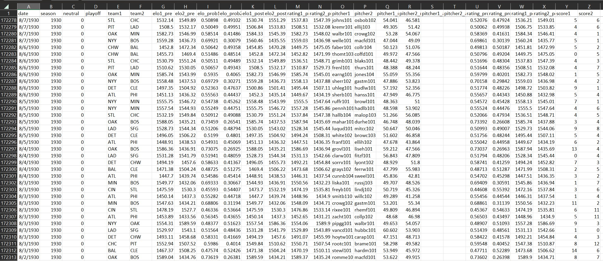

And here is what the MLB Teams dataset looks like:

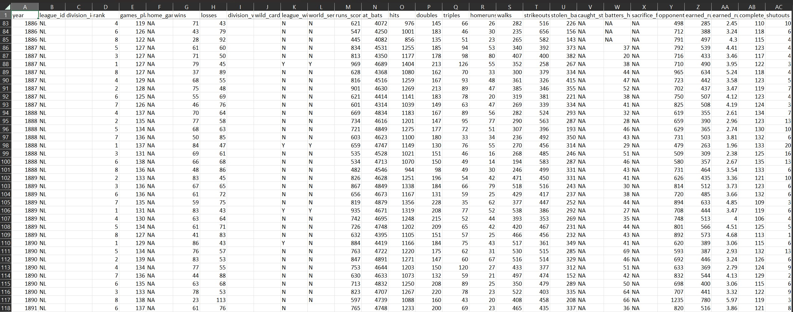

After a bit of digging around the internet, it seems like the last change to the MLB, team-wise, is the addition of two new teams in **1998**.

[MLB Elo](https://github.com/fivethirtyeight/data/tree/master/mlb-elo) has data for all of the MLB from the beggining to now ( 2023 season ).

[MLB Teams](https://www.openintro.org/data/index.php?data=mlb_teams) has data from the first official game ( 1876 ) to the 2020 season.

With this information, let's trim our datasets to have data within the same time frames. I'm not too sure what tool I want to use for my final visualization, but I am going to use a Google Colab notebook to give us prepared datasets.

Here is a link to the notebook: https://colab.research.google.com/drive/1q-Hj96FndgaTznTcuURxZ4jrsf25MTRK?usp=sharing

Based off the questions asked from the previous section, I am planning on making the charts in the following format:

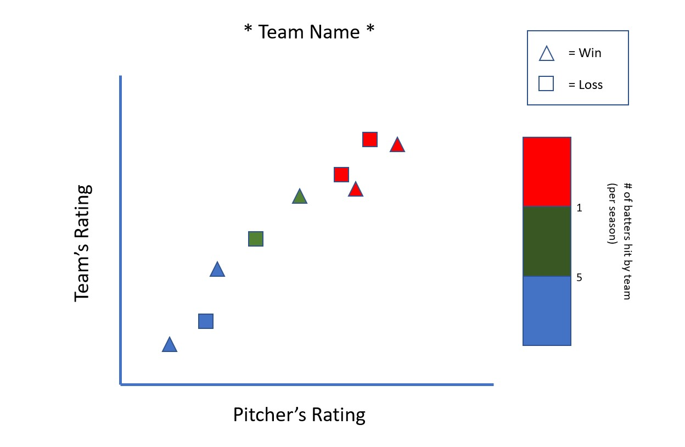

Note that the # of batters getting hit will be a gradient and the marks will be colored based off the gradient. Also, this chart will be one of thirty ( each team gets a chart ).

To achieve this, I began making sure that both datasets were consistent with the team information.

Below is the reading in of my data into the Colab Notebook. Note that the primary dataset ( MLB Elo ) will be considered df1 and the secondary dataset ( MLB Teams ) will be considered df2.

```python
import pandas as pd
import numpy as np

df1 = pd.read_csv( 'https://projects.fivethirtyeight.com/mlb-api/mlb_elo.csv' )
df2 = pd.read_csv( 'mlb_teams.csv' )
```

Here is trimming the primary dataset so that the 1998-2020 seasons are the only ones, and the number of unique teams:

```python
df1 = df1[df1['season'].between(1998, 2020)]

print( 'Unique teams after 1998:\n\n', pd.unique(df1['team1']) )

print( '\nCount:', len(pd.unique(df1['team1'])) )
```

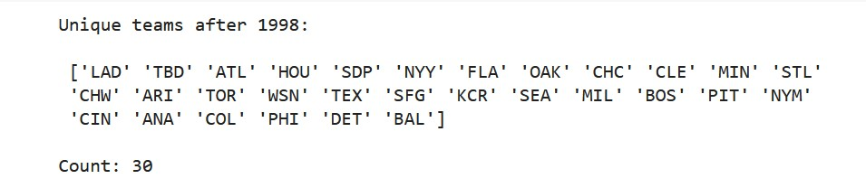

Here is the same attempt for the secondary dataset:

```python
df2 = df2[df2['year'].between(1998, 2020)]

print( 'Unique teams after 1998:\n\n', pd.unique( df2['team_name'] ) )

print( '\nCount:', len( pd.unique( df2['team_name'] ) ) )
```

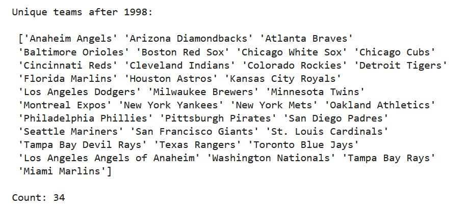

Unfortunately, it looked like there were four more teams than there are supposed to be. After taking a look, I've realized that four of the same teams have been entered as different entities. To fix this, I ran the following code: 

```python
df2 = df2.replace('Los Angeles Angels of Anaheim', 'Anaheim Angels')
df2 = df2.replace('Tampa Bay Devil Rays', 'Tampa Bay Rays')
df2 = df2.replace('Florida Marlins', 'Miami Marlins')
df2 = df2.replace('Montreal Expos', 'Washington Nationals')

print( 'Unique teams after 1998:\n\n', pd.unique( df2['team_name'] ) )

print( '\nCount:', len( pd.unique( df2['team_name'] ) ) )
```
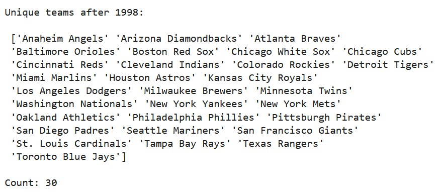

Looks like our data has been grouped properly by time and teams. 

Below is the code used to grab the columns needed from my secondary dataset:

```python
df2 = df2[['year', 'team_name', 'batters_hit_by_pitch']]
```

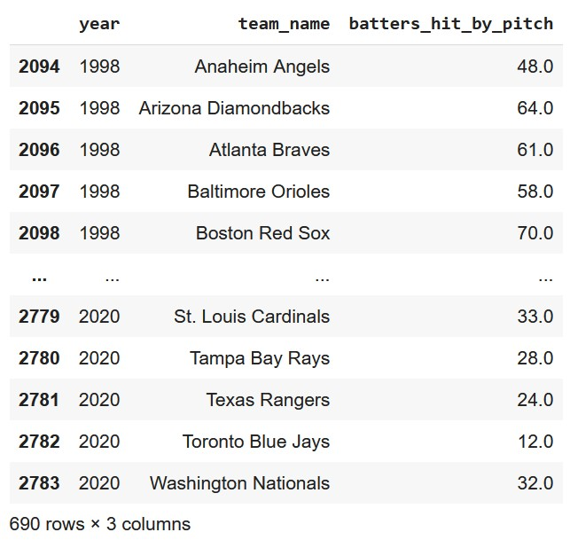

Similarly, I did the same thing to the first dataset. I also chose to add a 'W' or 'L' column depending on if the team won or lost the game:

```python
df1 = df1[['team1', 'team2', 'score1', 'score2', 'elo1_pre', 'elo2_pre', 'pitcher1_rgs', 'pitcher2_rgs', 'season']]

df1['team1_winloss'] = np.where(df1['score1'] > df1['score2'], 'W', 'L')

df1['team2_winloss'] = np.where(df1['score1'] < df1['score2'], 'W', 'L')
```

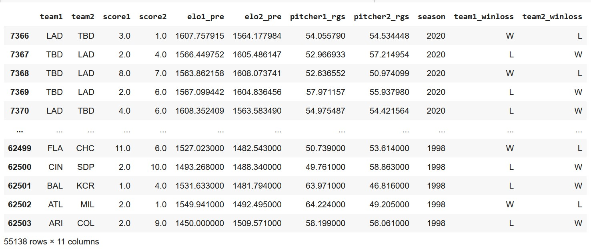

Now we should have all the data necessary to make our visualization. One of the last things I chose to do was to change the abreviated teams into their full name. I used the following code to achieve that:

```python
abbr = ['LAD', 'TBD', 'ATL', 'HOU', 'SDP', 'NYY', 'FLA', 'OAK', 'CHC', 'CLE', 'MIN', 'STL',
              'CHW', 'ARI', 'TOR', 'WSN', 'TEX', 'SFG', 'KCR', 'SEA', 'MIL', 'BOS', 'PIT', 'NYM',
              'CIN', 'ANA', 'COL', 'PHI', 'DET', 'BAL']

full = ['Los Angeles Dodgers', 'Tampa Bay Rays', 'Atlanta Braves', 'Houston Astros', 'San Diego Padres', 'New York Yankees', 'Miami Marlins', 'Oakland Athletics', 'Chicago Cubs', 'Cleveland Indians', 'Minnesota Twins', 'St. Louis Cardinals', 'Chicago White Sox', 'Arizona Diamondbacks', 'Toronto Blue Jays', 'Washington Nationals', 'Texas Rangers', 'San Francisco Giants', 'Kansas City Royals', 'Seattle Mariners', 'Milwaukee Brewers', 'Boston Red Sox', 'Pittsburgh Pirates', 'New York Mets', 'Cincinnati Reds', 'Los Angeles Angels', 'Colorado Rockies', 'Philadelphia Phillies', 'Detroit Tigers', 'Baltimore Orioles']

df1 = df1.replace( abbr, full )
```

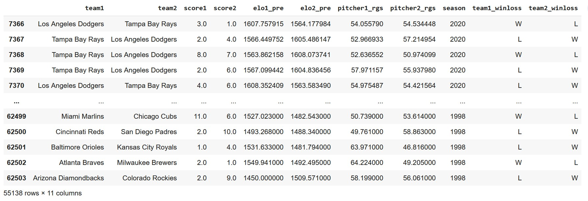

Making smaller tweaks now, I chose to have each row stand for only one team to make less work when making the visualization itself. To do this I used the following code:

```python
df3 = df1[['team1','elo1_pre', 'pitcher1_rgs', 'season', 'team1_winloss']]
df4 = df1[['team2','elo2_pre', 'pitcher2_rgs', 'season', 'team2_winloss']]
df4 = df4.rename(columns={'team2': 'team1', 'elo2_pre': 'elo1_pre', 'pitcher2_rgs': 'pitcher1_rgs', 'team2_winloss': 'team1_winloss'})
df5 = pd.concat([df3, df4], ignore_index=True)
```

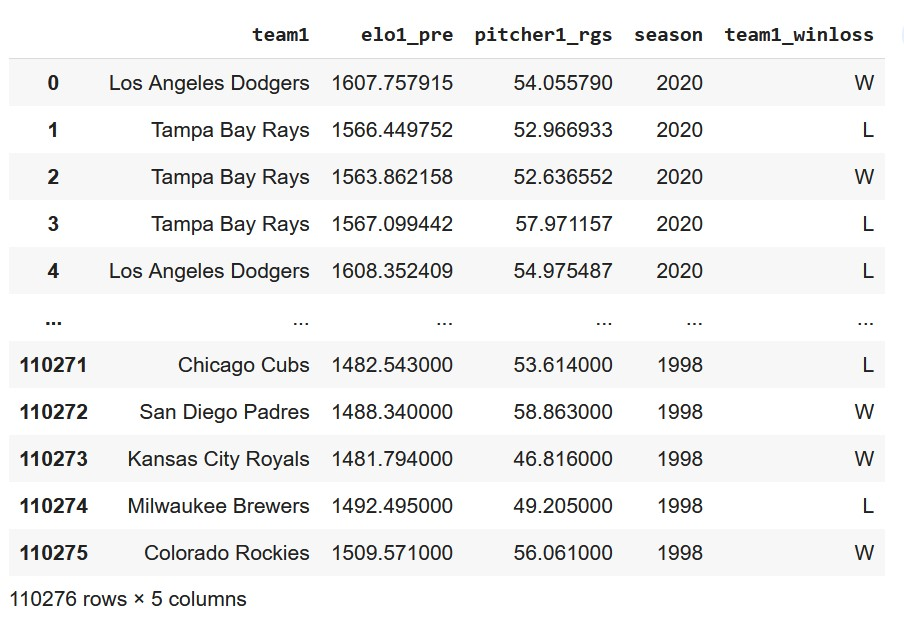

Finally, I wanted to have everything be on the same table, so I ran the following code:

```python
df2 = df2.rename(columns={'year':'season', 'team_name':'team1'})

df5 = df5.merge(df2, how='left', on=['season','team1'])
```

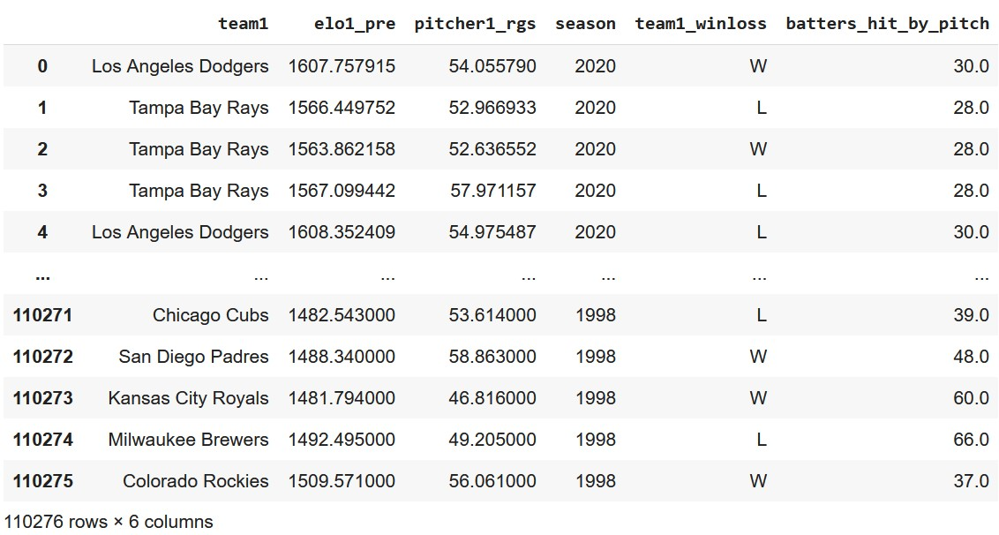

With this, I exported the dataset to my local computer as a .CSV file.

I now had everything needed for the visualization. The next step, I'll choose the tool and the implementation for this visualization.

## Final Implementation

For the final implementation of this chart, I decided to use Python in a Google Colab notebook.

Here is a link to the notebook used:   
https://colab.research.google.com/drive/1WQQ--VGIovkNIXcjix8xyibUWMhkWD4Q?usp=sharing


Before beginning, I took a final look at the cleaned data and renamed the columns for ease of understanding.

Since the data pre-procesing has been done, it only took a few lines of code to give me an output expected. Here is the code used:

```python
import seaborn as sns
import pandas as pd
import matplotlib as plt

# from google.colab import files
# uploaded = files.upload()

df = pd.read_csv('MLBCleaned.csv')

colorPalette = sns.color_palette("RdYlGn_r", len(pd.unique(df['NumBattersHit'])))

g = sns.FacetGrid(df, col="Team", col_wrap = 5, hue = 'NumBattersHit', palette = colorPalette)

g.map(sns.scatterplot, "TeamRating", "PitcherRating")
g.add_legend()

# g.savefig("finalChart.png")
```

To begin with, I ended up not using the attribute of wins / losses for this visualization. It would have added something to look at, but would have been a bigger distractor than anything.

After research on the best / easiest way to make a small multiples chart, the [seaborn](https://seaborn.pydata.org/) library seemed like the best option. After importing the library, here is the first line of code written:

```python 
g = sns.FacetGrid(df, col = "Team", col_wrap = 5, hue = 'NumBattersHit', palette = colorPalette)
```

Here, ```col = 'Team'``` is making a window for each team type, ```col_wrap = 5``` is making the visualization a 6x5 grid, ```hue = 'NumBattersHit``` is determing the color of the marks based on the number of batters hit, and ```palette = colorPalette``` is making a gradient from green to red to indicate the number of batters hit.

```python
g.map(sns.scatterplot, "TeamRating", "PitcherRating")
g.add_legend()
```
Here, we are using a scatterplot idiom for each of the 30 charts and using the quantitative variables `TeamRating` and `PitcherRating`. The `add_legend` statement will help indicate the number of batters hit.

Once our visualization was made, I used 3rd party software to add a title. Here is the final visualization:

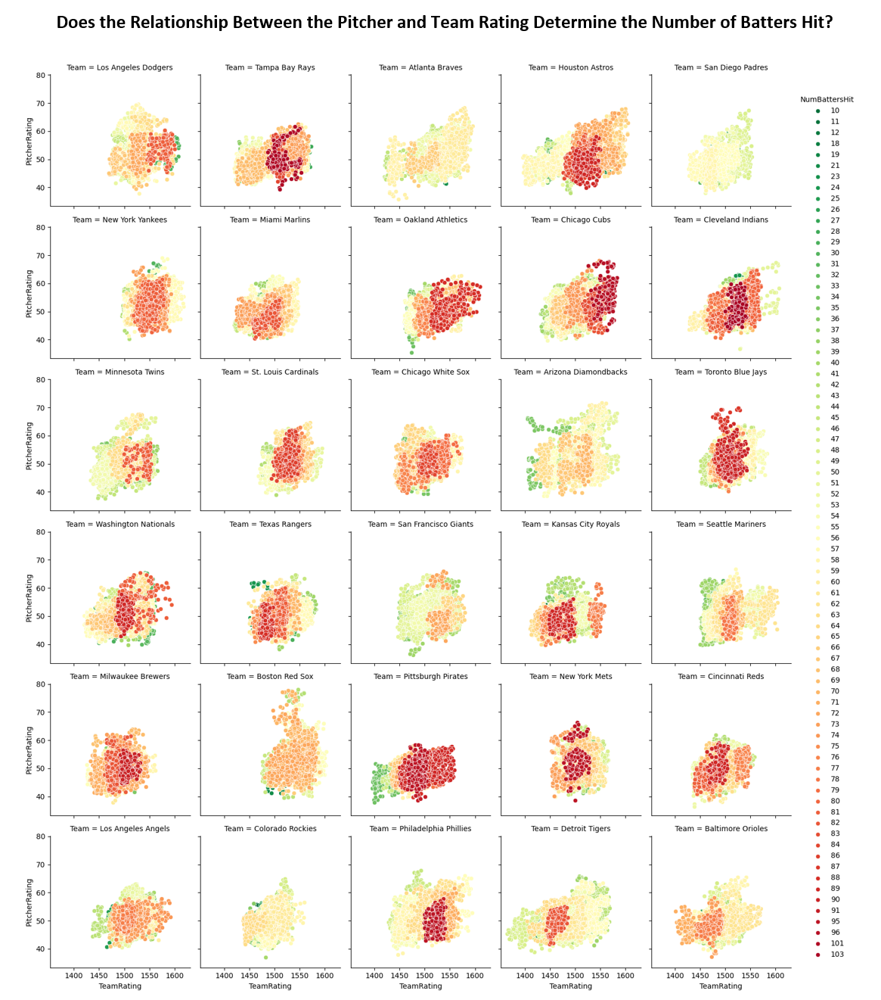

Taking a look at our final visualization, it seems like the relationship between the pitcher and team rating does not necessarily determine the number of batters getting hit for every team. 

There are some situations where there could be a relationship. For example, the Chicago Cubs and the Oakland Athletics have had a few seasons where the pitcher and team performed well, but there were many batters hit. Here is looks like there's a coorelation between the team's / pitcher's success and the number of batters hit.

In an opposite situation, teams like the Detroit Tigers and the Kansas City Royals did not perform well pitcher and team wise, but still ended up hitting a good amount of batters.

Something interesting found from the chart shows how much each team abuses other team's batters. The Padres, Braves, Giants, and Rockies pitched a lot safer than most of the league. Teams like the Pirates and the Indians were demolishing their batters.

## References
- [MLB Elo Dataset](https://github.com/fivethirtyeight/data/tree/master/mlb-elo)
- [Major League Baseball Teams Data](https://www.openintro.org/data/index.php?data=mlb_teams)
- [seaborn Library Documentation](https://seaborn.pydata.org/)
- [Small Multiples Charts w/ seaborn](https://seaborn.pydata.org/generated/seaborn.FacetGrid.html)
- [Pandas Documentation](https://pandas.pydata.org/docs/index.html)
- [NumPy Documentation](https://numpy.org/doc/)
- [MLB Wikipedia](https://en.wikipedia.org/wiki/Major_League_Baseball)
